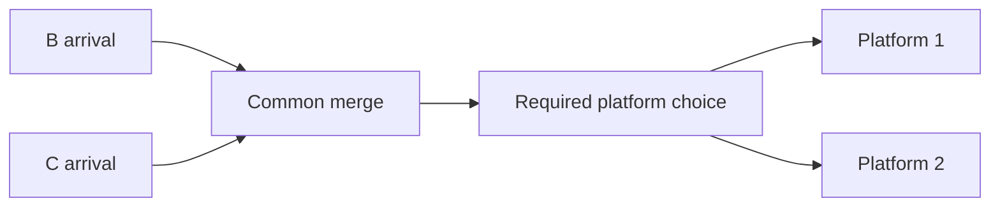

# Railway pattern cases

Version 0.1. These are contextual design cases, not an automatic geometry library.
Tracked descriptions remain usable without the ignored local evidence. Local paths
below are relative to the project and provide deeper evidence when available.

## F1 — Controlling fan boundaries before intermediate tracks

**Context:** Wickham platforms 6–8 share an approach. Earlier intermediate tracks
constrained the more demanding outside connection. The user built useful references.

**Arrangement:** place the two controlling routes around their straight-to-curve
transition, reserve the space between them, then choose the intermediate branch's
parent by compatible direction and sweep. In this example 7 follows 8 for part of
its length before joining 6. Exact parallelism throughout was unnecessary.

**Lesson:** choose route family and junction location before individually fitting
platforms. Numbering is not build order. For a mirrored family, transform the whole
relationship, then inspect actual surroundings; do not mirror native IDs or assume
identical eligibility.

**Limits:** no universal split angle, radius or precise junction coordinate proved.
An accepted manual curve does not establish that the bridge's candidate is identical.
Local evidence: `.local_runs/design/terminal_16_8_12_8/manual02`, `manual03`,
`operation23`, `operation25`; detailed outcomes in the handbook.

## F2 — Compact staggered fan from two ordinary turnouts

The first captured manual fan reference is now available in
[Shefford staggered fans](examples/SHEFFORD_FANS.md), with native controls, a scaled
plan and six successful directional path queries. Its two ordinary turnouts provide
three exits: the middle route branches early from the outer sweep. See F1 for the
general ordering lesson; the measured approximately 27–28-unit node separation is
an example, not a minimum. Native construction cannot be inferred from a schematic
that collapses both junctions into a single three-way switch.
The measured 10/15-unit outlet offsets include platform space: the user intended
a 5-unit-wide platform in the first 10-unit gap. A track-only variation can target
5/10-unit offsets. Select the cross-section from its function before fitting;
neither set of offsets defines the staggered-turnout pattern itself.
The user subsequently supplied both 5/10 mirrored versions. Their
[captured comparison](examples/SHEFFORD_TRACK_ONLY.md) confirms the same arrangement
and six new native paths, with approximately27.5-unit node separation. Both sets are
manual reference data, not an agent-designed transfer success.

Prospective transfer: [Challenge02](examples/challenge02/DESIGN.md) built two such
nested families into oblique six-lead receiving geometry. All four fan branches
accepted their first selected native fit;12 full arrival/return paths verified.
The designer finds the result coherent; user visual approval is pending. This
adds a practical transfer case, not a universal spacing or curvature prescription.

## X1 — Compact ordinary crossover groups

**Context:** six approach tracks retain their through functions while adding the
required platform choices. Successive full-width exchange zones made Wickham long.

**Arrangement:** separate ordinary single crossovers; overlap longitudinally where
they occupy compatible neighbouring strips. Coordinate turnouts that share a rail.
Follow every required route in its direction: an exchange must occur before the
next required exchange, without an unintended reversal.

**Lesson:** plan exchanges as a group; omit pointwork serving no requested purpose.
Extra incidental connectivity is not automatically a failure unless forbidden.

**Limits:** P59's roughly 40–50-unit crossover spans are examples, not minima.
No universal gap is established. Native acceptance and directional paths must be
established at the actual site. Evidence: handbook P58/P59 descriptions.

## J1 — Fork placement determines the crossing arrangement

**Context:** the earlier P75 mainline split bent around retained branch structures
and spread crossings along a large footprint. User proposed branching UP(slow)
before the bridge, allowing three upper paths across the lower fast pair.

**Lesson:** compare fork-before/fork-after and shared corridors at the layout stage.
Principal-route priority can justify replacing secondary structures. This topology
choice can matter more than optimising a curve inside the wrong arrangement.

**Evidence:** `.local_runs/live_python_interface/p75/compact_build/`;
eight mainline paths verified. Width closed earlier and the user liked the local
improvement. This does not endorse the later entire P75 junction's design quality.

**Limits:** the particular heights and footprint are site results, not templates
for all grade-separated junctions. Required branch functions must still have space.

## S1 — Native structure sequence can change feasibility

**Context:** a four-track parallel bridge rejected for both operator and user.
Clearing tracks, preparing terrain, building the shared upper structure and then
the diveunder succeeded. Elsewhere an existing generated structure obstructed an
E connection until its parent rails were rebuilt around the lower route.

**Lesson:** distinguish the desired final arrangement from how the engine can build
it. Rebuild parent railway proposals through supported operations. A generated
model's bounds do not identify a particular obstructing pillar.

**Limits:** neither sequence is universal. Use current surface/rail elevations;
the user later required an absolute z=1 floor at Complex Junction after water
appeared. Do not repeat the earlier relative 15-unit excavation blindly.
Evidence: P75 `overpass_first/group_checks.json`, and `branch_coupled/` outcomes
summarised in the handbook and final handoff.

## O1 — Shared station choices belong after their required arrivals merge

**Context:** P75 had 18 infrastructure paths but a return turnout before the C/B
merge omitted two station paths. A compensating feeder loop was built and removed.

**Lesson:** include platform arrival and departure choices in the original directed
plan. Move a wrongly ordered source to the common approach before considering an
extra connection. For an operating failure, check signal direction and bindings:
two reversed D/E signals were corrected without new track.

**Limits:** this diagram is functional order, not a scaled track plan. Both choices
still need a native spatial solution; intervening fast tracks can require separation.
Evidence: `.local_runs/live_python_interface/p75/branch_coupled/turnarounds/`;
final `restored03_station.json` passes all 16 scoped terminal routes.

## Contributions from manually built examples

The first contribution, two mirrored compact fans near Shefford, is captured above.
For future fan examples, keep neighbouring tracks so the spatial constraint is visible.

If convenient, place two variations side by side: the preferred layout and a tighter
or mirrored one that still works. No need to create a deliberately bad layout or
finish another whole junction. Use a disposable save; simple nearby labels or station
names such as `Fan A` and `Fan B` make discovery easier.

Provide the save name, which direction trains approach, intended connections and
what makes the result good to you. An overhead view is useful; for graded examples
also a side/oblique view. Do not measure all coordinates manually: the bridge should
extract fresh geometry, elevations and topology where supported. Missing feedback
must remain unknown, not guessed.

During inspection record: context and role map; annotated overview; available native
track/structure geometry; known construction sequence; what was tried and accepted;
functional proof level; user aesthetic judgement; limitations. Do not modify the
reference during an inspection-only task.

Later useful patterns, when needed: a compact pair of opposite single crossovers;
a paired diverging route with local grade separation and a return to normal spacing.

## G3 — Shallow level crossing span with earth-supported approaches

**Context:** Challenge03 double-track A/B mainline and paired C branch, four directed
movements. The conflicting C_DOWN movement crosses above both through rails.

**Pattern:** choose the crossing angle and both landing corridors first; build an
unconnected level deck close to the crossed tracks, then fit NORMAL earth-supported
ramps and the direct C_UP connection. Keep a level turnout lead when native feedback
shows that immediate vertical curvature is unsuitable. A shallow crossing trades
longitudinal length for lateral compactness.

**Evidence:** R5b native build,4/4 TRAIN paths, short12° deck, approximately7.5 units
laterally beyond outer rails; sampled rail footprint717.8×94.7. The user supplied
10–15° and5–10-unit visual guidance; these are not universal limits. No trains run.
Designer-reviewed and user-accepted on10October2026. [Record](examples/challenge03/DESIGN.md).

**Limits:** earthworks/abutments may need more room at other sites. Terrain, track
resource and native turnout shape matter. An adapter selection restriction is not
native rejection. R4's native success did not make its broad geometry acceptable.

## D4 — Plan a station district as connected route families

**Context:** Mid West C combines18 native platforms, two station reorders, two
regional flying junctions and an independent cross pair. Fast and slow networks
remain separate; the slow banks terminate rather than form an accidental bypass.

**Pattern:** reserve fans, reorders, ordinary track order, regional branches and
receiving interfaces together. Use one common direction frame on both approaches.
Carry actual station/depot footprints and open sides in those reservations. Finish
turnouts before signals, then place the incoming decision signals before all
platform choices. Native fitting may adjust local representation without changing
that route-family arrangement.

**Evidence:** [Challenge04](examples/challenge04/DESIGN.md) retains its central
arrangement through construction. All36 directed platform routes use their intended
running roads; six trains demonstrate circulation. The southern depot footprint
omission caused local bypass rework and is retained as a planning failure. The user accepted the overall design on 10 October with future refinements only;
this case does not prove arbitrary whole-map planning or capacity. Cargo loading is a distinct operating configuration result.

**Future refinement:** retain approximately 30 m straight platform leads, shorten
slow fans relative to throat crossover speeds, smooth adjacent slow flyover sweeps,
and provide about 300 m open-line signal spacing. For the real mega-city map,
reserve urban/road space first: narrow six-track approach (including independent
Cross pair), flyovers around 1.2 km, regional branches around 3 km. These are user
planning preferences; full context and unmeasured speed estimates are in the linked
review. Do not retrofit the accepted demonstration.
