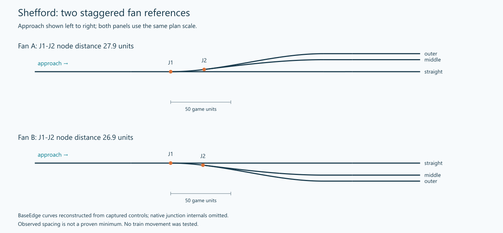

# Shefford staggered fans — first manual design reference

Captured 9 October 2026, game build 40420, adapter session
`pif_1791572697_48431435`. Read-only inspection after the user enabled the adapter
and restored two signals. Native save name is unavailable; Shefford Station is the
locator, construction 7391, position approximately (-1235.31, -5856.54, 2.10).
IDs are observation handles, not replay instructions or preservation requirements.

The two fans are separate from the station. In each panel the approach is shown
left to right, with J1 as the coordinate origin and equal longitudinal/lateral scale.
The drawing reconstructs BaseEdge curves from native controls; it does not depict
all native turnout internals. [Captured data](shefford-fans.json),
[vector plan](shefford-fans.svg).

## Intended arrangement and user preference

The user supplied two mirrored examples and prefers their compact asymmetric,
staggered arrangement. Approach is from the single straight track. J1 branches from
that straight into the outermost sweep; J2 branches from the outer sweep to form
the middle route. J2 was placed as close to J1 as the user's manual tool permitted.
The purpose is smooth, realistic-looking train motion without unnecessary wiggles.
Actual train traversal was not observed in this inspection.

The user clarified that the 10-unit straight-to-middle centreline gap reserves a
5-unit-wide platform, because this reference represents a station approach. Without
that platform, a track-only version could place the middle and outer leads at 5 and
10 units from the straight route. These are two different intended cross-sections,
not competing measurements of the same example. The supplied fans use 10/15;
the proposed 5/10 variation has not been built or verified by this inspection.

The user reports that a single-point three-way turnout could not be built. This
reference requires only two ordinary turnouts; a universal engine prohibition has
not been independently established. A three-track fan is not a request for a
single three-way switch.

## Measured reference, not construction limits

| Observation | Fan A | Fan B |
| --- | --- | --- |
| J1 native node | 59948 | 60038 |
| J2 native node | 59963 | 59992 |
| J1-J2 node-to-node distance | 27.88 | 26.88 |
| Sampled length of connecting BaseEdge curve | 27.90 | 26.89 |
| Middle / outer lead offsets from straight | +10.00 / +15.00 | -10.00 / -15.00 |
| BaseEdge elevation throughout captured fan | 2.10 | 2.10 |
| Captured track edges | 14 | 15 |
| Native directed approach-to-exit paths | 3 of 3 | 3 of 3 |

Values use native game coordinates. Curve lengths are calculated from 101 samples
of the BaseEdge cubic, not a continuous proof or the sum of internal movement edges.
The two arrangements are mirrored in intent and outlet placement, not exact
coordinate copies. Differences in segment count are not defects.

Both current approach signals have oneWay=1 (59590 on 59592; 59610 on 59615).
All six intended directional paths pass the native TRAIN query after these signals
were added. No reservation, capacity, speed or train-motion claim follows.

## Transferable design decisions

1. Plan the straight, middle and outer routes as one family. Preserve the through
   straight and establish the outer sweep before inserting the middle connection.
2. Choose the middle route's parent by its developing direction and available
   corridor. Here the outer curve provides a useful departure for the middle route;
   selecting three independent connections would discard that relationship.
3. Locate the second turnout early enough to share the sweep and retain compactness.
   Seek useful native-accepted close spacing, not a copied minimum or an endless
   search for the mathematically closest point.
4. Judge the whole route through both junctions and into the leads. A short link
   alone does not guarantee a smooth fan, and two close junctions are not always
   appropriate where neighbouring routes or geometry differ.
5. Mirror relationships, then re-fit to the actual site. Keep the controlling outer
   sweep and a compatible middle branch; do not require matching segment counts.

This supports the earlier boundary-first lesson with a compact, user-preferred
native example. It does not establish that every middle track should join an outer
one, that all curves must have one curvature sign, or that reverse curves are banned.

## Inspection coverage and limitations

The final bounded discovery covers both complete track components, with four leaf
nodes and two degree-three nodes each; every observed node's incident tracks is
included. 29 BaseEdge controls and structures were read. Track objects were refreshed
after the user restored signals; those additions replaced two native track handles.

A geometry query on a signalled edge returned `rail_movement_geometry_not_unique`.
BaseEdge controls and object readback suffice for this pattern, so no bridge repair
was attempted. Earlier movement-geometry lengths on junction-related edges cover
only parts of the BaseEdge extent; they were not used as turnout spacing.
The initial query before adapter activation timed out in the old session; the fresh
session completed normally. These observations remain in the local evidence.

Raw receipts and analysis: `.local_runs/design/shefford_fans/`, including
`fan_geometry.json`, `fan_objects_*.json`, `routes_summary.json` and six route receipts.
The versioned JSON retains the geometry and route summary needed for offline review.
No game construction, terrain, simulation or save changes were made by this inspection.

## Next exercise

Plan a track-only variant with middle/outer lead offsets of 5/10 units before fitting.
Remove the platform-space requirement from its brief; retain the staggered branch
hierarchy and smooth sweep intent. Do not assume its junction spacing will be the
same as the station-like 10/15 reference.
Use a scaled plan and predict J1/J2 regions and the parent of the middle route.
Compare with this reference by relationships, footprint and visual continuity;
evaluate attachment eligibility at the new site. Do not simply paste these controls
and call the result evidence of generalised design ability. No variant is built yet.
