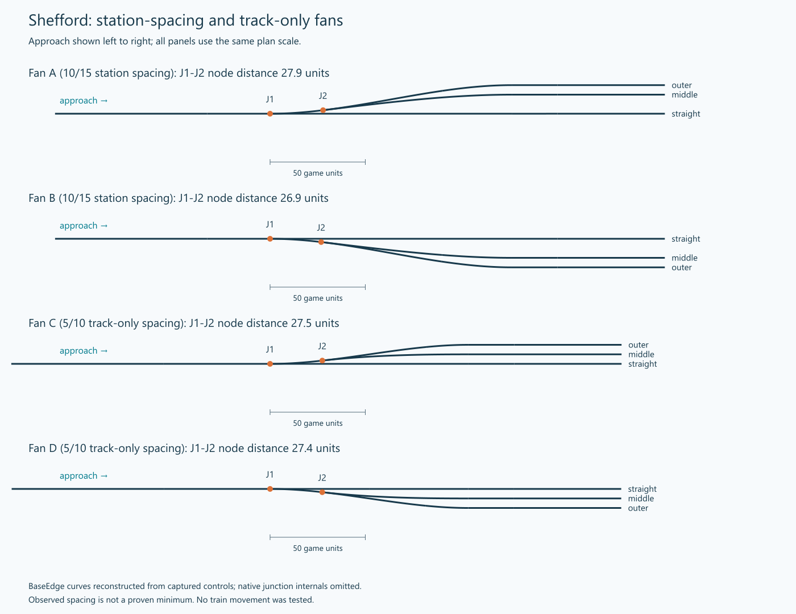

# Track-only fan reference

The track-only 5/10 offsets remove that platform allowance. The approach is the single straight track. Build the outermost
branch first, then the middle route from that branch near the first turnout.
These user-built mirrored examples supply reusable curve relationships. Their
measured spacing is not a universal native limit. JSON/SVG geometry alongside the
image is reference data; old native IDs must not be used as current attachments.
See [patterns](../PATTERNS.md) for how to transfer the arrangement to a new site.
